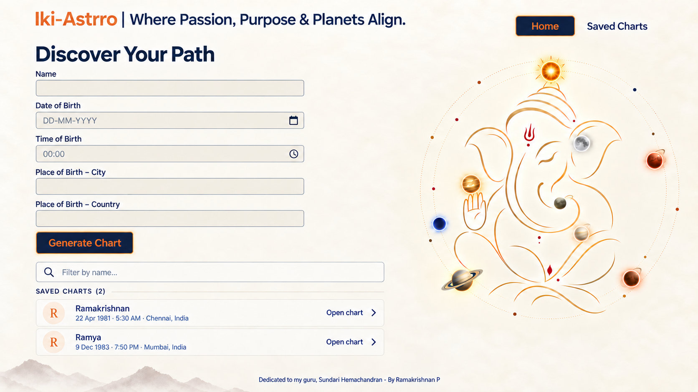

# Iki-Astrro brand guide

This is the canonical visual-brand reference for the Iki-Astrro application. It supersedes the former dark-only parchment/indigo direction.

## Brand reference

The supplied main screen is the visual source of truth for the app shell, color relationships, typography, Navagraha/Ganesha composition and footer treatment.

## Brand lockup

Use this wording and punctuation:

**Iki-Astrro | Where Passion, Purpose & Planets Align.**

- `Iki-Astrro` is sunset orange.
- The pipe is midnight blue.
- The tagline is midnight blue in standard interface typography.
- Do not replace the pipe with a decorative divider or change the tagline copy.

## Core palette

These reproducible working tokens were sampled and normalized from the canonical image. Fine gradients, glows and illustration colors may vary within the source artwork, but interface colors should use these tokens.

| Role | Token | Value | Use |
|---|---|---|---|
| Warm canvas | `--brand-canvas` | `#FAF5EA` | app background and quiet open space |
| Raised canvas | `--brand-surface` | `#FFFDFC` | fields, rows and elevated content surfaces |
| Midnight blue | `--brand-midnight` | `#0F2041` | headings, body text, navigation and action fills |
| Sunset orange | `--brand-sunset` | `#F47A24` | brand name, borders, emphasis and action text |
| Warm line | `--brand-line` | `#D9D1C7` | field, row and section dividers |
| Muted blue | `--brand-muted` | `#53698D` | placeholders and secondary metadata |
| Soft peach | `--brand-peach` | `#FFF0E5` | avatars and low-emphasis orange tint |

Semantic astrology colors for dignity, planets, dashas and evidence remain separate tokens. They must be tuned to remain readable on the warm canvas and must not redefine the core brand palette.

## Typography

- Use **Manrope** consistently across every page. Use exactly three interface size levels: Display `clamp(38px, 3.05vw, 53px)` for “Discover Your Path”; Tagline `clamp(20px, 2vw, 37px)` for “Where Passion, Purpose & Planets Align.”; and Control `19px` for “Preferences” and navigation controls. Do not introduce additional interface size levels; use weight, spacing, and color for hierarchy.
- Use normal Manrope interface typography for the tagline; it is not a display-serif element.
- Preserve a clear weight hierarchy rather than introducing another font family.
- Use tabular numerals where alignment of dates, degrees, scores or periods benefits from it.

## Main-screen copy and hierarchy

- Primary heading: **Discover Your Path**.
- The former subheading is removed; do not add replacement explanatory copy beneath the heading.
- The form remains the primary action area, with saved-chart search and rows directly below it.
- The main action label is **Generate Chart**.

## Actions

- Primary actions use a midnight-blue fill, sunset-orange text and sunset-orange border.
- Do not use white text on primary action buttons.
- Selected navigation may use the same midnight-fill/sunset-text treatment.
- Secondary navigation remains midnight-blue text on the warm canvas.
- Focus, hover and pressed states must remain visibly distinct and meet accessible contrast targets.

## Navigation and composition

- Keep the top navigation visually closer to the Ganesha/Navagraha illustration, as shown in the canonical main screen.
- Preserve breathing room between the brand lockup and the form rather than centering navigation across the entire page.
- On analysis screens, the same palette and Manrope typography apply even when the information density increases.

## Preserved assets and invariants

- Preserve the existing Ganesha illustration.
- Preserve the existing Navagraha arrangement, orbital relationships, glow character and placement.
- Preserve the existing mountain/footer artwork and dedication footer.
- Footer copy remains: **Dedicated to my guru, Sundari Hemachandran - By Ramakrishnan P**.
- Do not redraw, reorder or replace these assets during the app-wide palette pass.

## Application rule

Every screen should feel like a denser continuation of this main screen: warm, spacious and precise, with midnight-blue information structure and sunset-orange emphasis. Horoscope Explorer screenshots remain references for field coverage only; they do not define Iki-Astrro's colors, typography or header navigation.

## UI component standard

MudBlazor is the canonical component system. New and migrated pages use the MudBlazor light theme, shared theme tokens, MudLayout/MudAppBar/MudMainContent, and MudBlazor controls. The Ganesha/Navagraha image remains preserved on the home page. Chart rendering itself remains outside the MudBlazor restyling scope.

## Header and chart-page navigation

The shared header uses the Iki-Astrro brand lockup and tagline. Navigation order is Home, Preferences, Saved Charts. Home must not render a duplicate navigation row. Workspace chart-page person names use sunset orange; Open Chart continues to target /charts/{id}.

