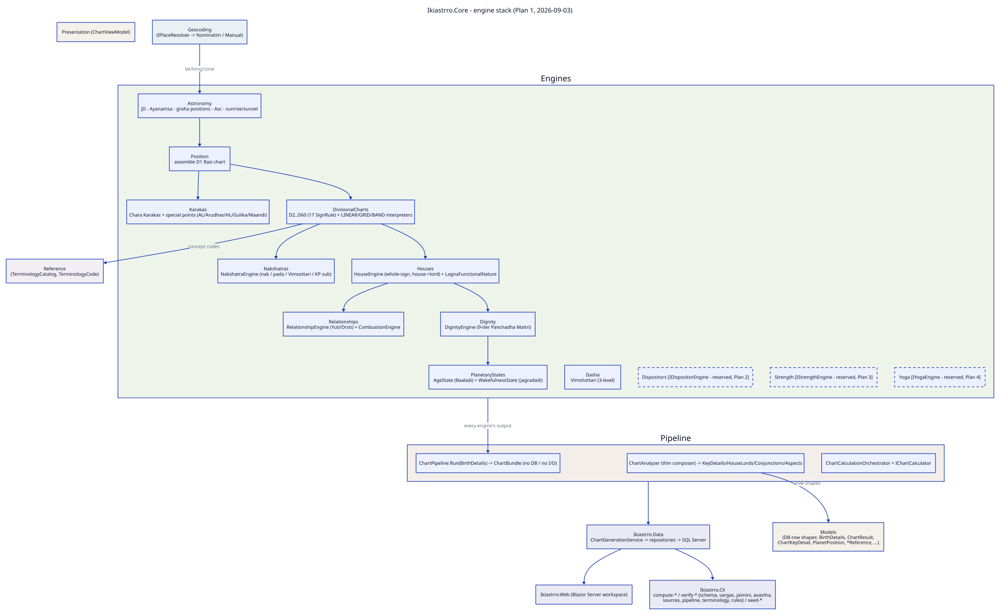

# Ikiastrro.Core — .NET engine map

Generated map of the calculation engine (`src/Ikiastrro.Core/`), grouped by **engine**.
Regenerated 2026-09-03 for the Plan 1 layout (`Engines/<Name>/`, one namespace per engine).
Sibling projects (`Ikiastrro.Cli`, `Ikiastrro.Data`, `Ikiastrro.Web`) consume Core and are not
detailed here.



<details><summary>D2 source</summary>

```d2
direction: down

title: Ikiastrro.Core - engine stack (Plan 1, 2026-09-03) { shape: text; near: top-center; style.font-size: 22 }

# ---- cross-cutting (left) ----
Models: "Models\n(DB-row shapes: BirthDetails, ChartResult,\nChartKeyDetail, PlanetPosition, *Reference, ...)" { style.fill: "#f4f1ea" }
Reference: "Reference\n(TerminologyCatalog, TerminologyCode)" { style.fill: "#f1eef4" }
Presentation: "Presentation (ChartViewModel)" { style.fill: "#f4f1ea" }
Geocoding: "Geocoding\n(IPlaceResolver -> Nominatim / Manual)" { style.fill: "#eaf1f4" }

# ---- the engine stack, bottom-up ----
Engines: {
  style.fill: "#eef4ea"
  Astronomy: "Astronomy\nJD - Ayanamsa - graha positions - Asc - sunrise/sunset"
  Position: "Position\nassemble D1 Rasi chart"
  DivisionalCharts: "DivisionalCharts\nD2..D60 (17 SignRule) + LINEAR/GRID/BAND interpreters"
  Houses: "Houses\nHouseEngine (whole-sign, house->lord) + LagnaFunctionalNature"
  Nakshatras: "Nakshatras\nNakshatraEngine (nak / pada / Vimsottari / KP sub)"
  Dignity: "Dignity\nDignityEngine (9-tier Panchadha Maitri)"
  Karakas: "Karakas\nChara Karakas + special points (AL/Arudhas/HL/Gulika/Maandi)"
  PlanetaryStates: "PlanetaryStates\nAgeState (Baaladi) + WakefulnessState (Jagradadi)"
  Relationships: "Relationships\nRelationshipEngine (Yuti/Drsti) + CombustionEngine"
  Dasha: "Dasha\nVimshottari (3-level)"
  Dispositors: "Dispositors  [IDispositorEngine - reserved, Plan 2]" { style.stroke-dash: 4 }
  Strength: "Strength  [IStrengthEngine - reserved, Plan 3]" { style.stroke-dash: 4 }
  Yoga: "Yoga  [IYogaEngine - reserved, Plan 4]" { style.stroke-dash: 4 }

  Astronomy -> Position -> DivisionalCharts
  DivisionalCharts -> Houses
  DivisionalCharts -> Nakshatras
  Houses -> Dignity
  Position -> Karakas
  Dignity -> PlanetaryStates
  Houses -> Relationships
}

Pipeline: {
  style.fill: "#f4eeea"
  ChartPipeline: "ChartPipeline.Run(BirthDetails) -> ChartBundle  (no DB / no I/O)"
  ChartAnalyzer: "ChartAnalyzer (thin composer) -> KeyDetails/HouseLords/Conjunctions/Aspects"
  Orchestrator: "ChartCalculationOrchestrator + IChartCalculator"
}

Geocoding -> Engines.Astronomy: "lat/long/zone"
Engines -> Pipeline.ChartPipeline: "every engine's output"
Pipeline.ChartAnalyzer -> Models: "row shapes"
Engines.DivisionalCharts -> Reference: "concept codes"

Data: "Ikiastrro.Data\nChartGenerationService -> repositories -> SQL Server" { style.fill: "#eaeaf4" }
Cli: "Ikiastrro.Cli\ncompute-* / verify-* (schema, vargas, jaimini, avastha,\nsources, pipeline, terminology, rules) / seed-*" { style.fill: "#eaeaf4" }
Web: "Ikiastrro.Web (Blazor Server workspace)" { style.fill: "#eaeaf4" }

Pipeline -> Data
Data -> Cli
Data -> Web
```

</details>

Regenerate: `d2 --theme 0 --pad 20 docs/artifacts/diagrams/dotnet_engine_map.d2 docs/artifacts/diagrams/dotnet_engine_map.svg`

---

## Engines (`src/Ikiastrro.Core/Engines/<Name>/` — namespace `Ikiastrro.Core.Engines.<Name>`)

### Astronomy (7 files) — JD, Ayanāṁśa, sidereal graha positions, Ascendant, sunrise/sunset

| File | Role |
|---|---|
| `SwissEphemerisProvider.cs` | `swe_calc` / `swe_rise_trans` wrapper; produces `SiderealPositions`, `SunTimes` (in this file) |
| `AstroMath.cs` | pure sidereal math — Normalize, nakshatra/pada helpers, the closed-form varga helpers (`GetNavamsaSign` etc.), DMS formatting |
| `AstroIds.cs` | name ↔ `tbl_*` id lookups (`PlanetId`, `SignId`) |
| `PlanetName.cs` / `ZodiacName.cs` / `ConstellationName.cs` | the graha / rāśi (Capricorn member = `Capricornus`) / nakshatra enums |
| `BirthMomentFactory.cs` | birth details + place → the resolved astronomical moment |

### Position (2 files) — assemble the D1 Rāśi chart

| File | Role |
|---|---|
| `D1ChartComputer.cs` | sign / degree-in-sign / retro / house-from-Lagna per graha + Ascendant |
| `D1RasiCalculator.cs` | `IChartCalculator` for D1 (registered first in `ChartCalculationOrchestrator`) |

### DivisionalCharts (26 files) — D2–D60 + the portable interpreters

| File | Role |
|---|---|
| `IVargaSignRule.cs`, `VargaSignRuleFactory.cs` | the rule contract + the `SignRuleKey` → rule switch (20 keys) |
| `LinearVargaSignRule.cs` + 16 `*SignRule.cs` (`HoraD2Classic`, `HoraD2UmaShambu`, `PanchamsaD5`, `SaptamsaD7`, `AshtamsaD8`, `NavamsaD9`, `DasamsaD10`, `RudramsaD11`, `ShashtamsaD6`, `ShodasamsaD16`, `VimsamsaD20`, `SiddhamsaD24`, `NakshatramsaD27`, `TrimsamsaD30`, `KhavedamsaD40`, `AkshavedamsaD45`) | the 17 divisional sign rules (the live compute path) |
| `VargaChartComputer.cs`, `VargaCalculator.cs` | apply a rule across all grahas → a varga `ChartAnalysisInput` |
| `IVargaMethodInterpreter.cs`, `VargaMethodInterpreterFactory.cs` | the portable-rule contract + `"method"` → interpreter |
| `LinearVargaInterpreter.cs` (`LINEAR_VARGA` `{factor,stride}`), `GridVargaInterpreter.cs` (`GRID_VARGA` — `parts × 12` sampled sign grid), `BandVargaInterpreter.cs` (`BAND_VARGA` — D30 unequal bands) | reconstruct a varga sign from `tbl_Rule_VargaScheme.RuleParametersJson`; proven equal to the C# rule over 360° by `verify-rules` |

### Houses (2 files) — whole-sign houses + functional nature

| File | Role |
|---|---|
| `HouseEngine.cs` | `GetHouseSign` / `GetSignLord` + `BuildHouseLords` (the `tbl_Chart_HouseLords` rows); extracted verbatim from `ChartAnalyzer` |
| `LagnaFunctionalNature.cs` | Parāśari functional benefic / malefic by Lagna |

### Nakshatras (1 file)

| File | Role |
|---|---|
| `NakshatraEngine.cs` | `ForLongitude` → nakshatra index / lord / KP sub-lord / overall pāda index (wraps the `AstroMath` helpers); extracted from `ChartAnalyzer` |

### Dignity (1 file)

| File | Role |
|---|---|
| `DignityEngine.cs` | exaltation / debilitation / Mūlatrikoṇa / own-sign + 9-tier `DignityStatus` (Pañchadhā Maitrī); was `ClassicalDignity`. Holds `DignityResult` |

### Karakas (10 files) — Jaimini Chara Karakas + special points

| File | Role |
|---|---|
| `CharaKaraka.cs`, `CharaKarakaCalculator.cs` | the 8-karaka enum + Aṣṭa assignment (Rahu keyed `30 − deg`) |
| `ArudhaCalculator.cs` | Arudha Lagna + the 12 Bhāva Arudhas |
| `HoraLagnaCalculator.cs` | Horā Lagna |
| `UpagrahaCalculator.cs` | Gulika / Maandi (day/night-part ruler arrays) |
| `SpecialPointSeed.cs`, `SpecialPointProjector.cs`, `SpecialPointCalculator.cs` | D1 longitude of each special point, projected into every varga's own zodiac |
| `ISthiraKarakaSource.cs`, `INaisargikaKarakaSource.cs` | **interface only** — Sthira / Naisargika Karaka, built in Plan 2 |

### PlanetaryStates (4 files) — the "avastha" engine (renamed from `Calculators`/`Models`)

| File | Role |
|---|---|
| `AgeStateCalculator.cs` | Bālādi (age) state from within-sign degree; was `BaaladiAvastha` |
| `WakefulnessStateCalculator.cs` | Jāgradādi (waking) state from dignity; was `JagradadiAvastha` |
| `PlanetaryStateComputer.cs` | builds the `tbl_Fact_PlanetaryState` rows; was `PlanetAvasthaComputer` |
| `PlanetaryStateModels.cs` | `PlanetaryStateRow` / `AgeStateRuleRow` / `WakefulnessStateRuleRow` / `PlanetaryStateRuleSet` / `PlanetaryStateFact`; was `Models/AvasthaModels.cs` |

Migration 16 renamed the backing tables (`tbl_Dim_PlanetaryState`, `tbl_Rule_AgeState`, `tbl_Rule_WakefulnessState`, `tbl_Fact_PlanetaryState`); every `StateName` / `AvasthaSystem` row value is unchanged — the English glosses (`Infant`, `Awake`, …) live as `en` rows in `tbl_Astro_Terminology`.

### Relationships (2 files)

| File | Role |
|---|---|
| `RelationshipEngine.cs` | Yuti (conjunction) + Dṛṣṭi (aspect): `FindConjunctions`/`FindAspects` + `BuildConjunctionRows`/`BuildAspectRows`; was `ClassicalRelationships` + the row-mapping extracted from `ChartAnalyzer` |
| `CombustionEngine.cs` | Asta (combustion) orbs, narrower when retrograde; was `ClassicalCombustion`. Holds `CombustionResult` |

### Dasha (4 files)

| File | Role |
|---|---|
| `VimshottariDashaCalculator.cs` | 3-level Vimśottari, partial-at-birth |
| `DashaPeriod.cs`, `DashaPeriodRecord.cs`, `LifeWeek.cs` | the period tree + life-in-weeks row shape |

### Dispositors / Strength / Yoga — reserved seams (interfaces only, built in Plans 2–4)

| File | Role |
|---|---|
| `Dispositors/IDispositorEngine.cs`, `DispositorChain.cs` | sign-lord traversal, final dispositor, mutual reception — Plan 2 |
| `Strength/IStrengthEngine.cs`, `ShadbalaResult.cs`, `VimsopakaResult.cs` | Ṣaḍbala + Vimśopaka — Plan 3 |
| `Yoga/IYogaEngine.cs`, `YogaResult.cs` | yoga detection (`PREDICATE_SET`) — Plan 4 |

---

## Cross-cutting namespaces

### `Ikiastrro.Core.Pipeline` (6 files)

| File | Role |
|---|---|
| `ChartPipeline.cs`, `ChartBundle.cs` | `Run(BirthDetails) → ChartBundle` — every engine, no DB, no I/O beyond the Swiss Ephemeris files. One consumer today: `verify-pipeline`. Not yet wired into `ChartGenerationService.GenerateAll` |
| `ChartAnalyzer.cs` | thin composer — the `keyDetails` loop + calls into House / Nakshatra / Relationship / Dignity / Combustion engines; returns `(KeyDetails, HouseLords, Conjunctions, Aspects)` |
| `ChartCalculationOrchestrator.cs`, `IChartCalculator.cs`, `ChartAnalysisInput.cs` | D1 + one `VargaCalculator` per `tbl_Rule_VargaScheme` row |

### `Ikiastrro.Core.Reference` (4 files) — terminology types only

| File | Role |
|---|---|
| `TerminologyCatalog.cs` | loaded-once lookup over `tbl_Astro_Terminology` (+`_Text`): `Label` / `Traditional` / `Describe` / `Meta`, default language `sa` → `en` → the code |
| `TerminologyCode.cs` | `const string` per Code the C# names (planets, signs, karakas); the full 236-concept set lives in the DB |
| `TerminologyRow.cs`, `TerminologyTextRow.cs` | the two DB-row record shapes |

### Other

| Namespace | Files | Role |
|---|---|---|
| `Ikiastrro.Core.Presentation` | `ChartViewModel.cs` | Web-facing view model |
| `Ikiastrro.Core.Models` | 18 files | DB-row / DTO shapes — `BirthDetails`, `ChartResult`, `ChartKeyDetail`, `PlanetPosition`, `VargaScheme`, the 5 `*Reference` records, `GenerationReport`, transit / Sade-Sati shapes. Kept plural; `PlanetPosition` + the `*Reference` records deliberately stayed here |
| `Ikiastrro.Core.Geocoding` | 3 files | `IPlaceResolver` → `NominatimPlaceResolver` / `ManualPlaceResolver` |
| `Ikiastrro.Core.LifeAreas` | `LifeAreaMap.cs` | Web workspace grouping |
| `Ikiastrro.Core.Transits` | `PlanetTransitEventFinder.cs` | slow-planet sign-crossing history (feeds Sade Sati, not the birth-chart pipeline) |

The old namespaces `Ikiastrro.Core.{Astro, Calculators, Jaimini, SpecialPoints}` and the top-level
`Ikiastrro.Core.Dasha` are **retired**.
