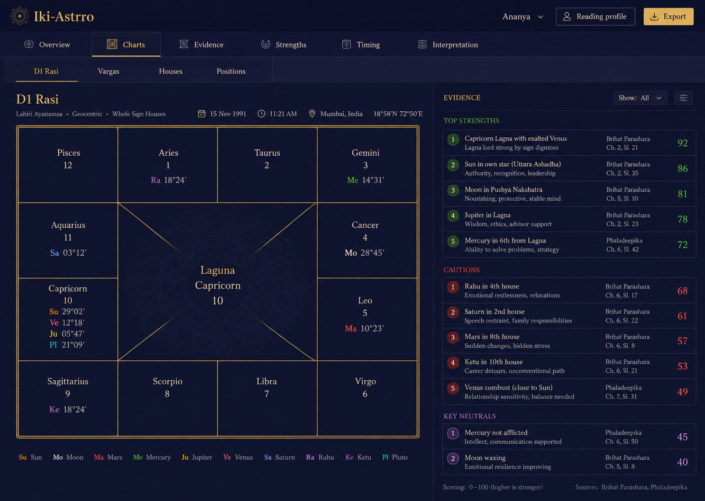
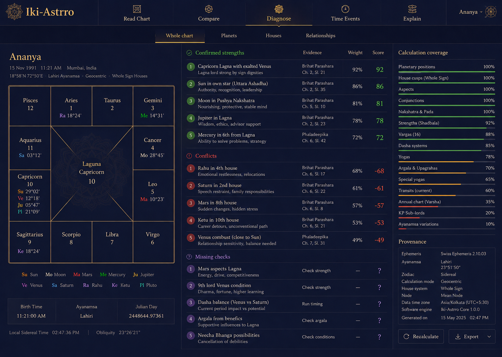
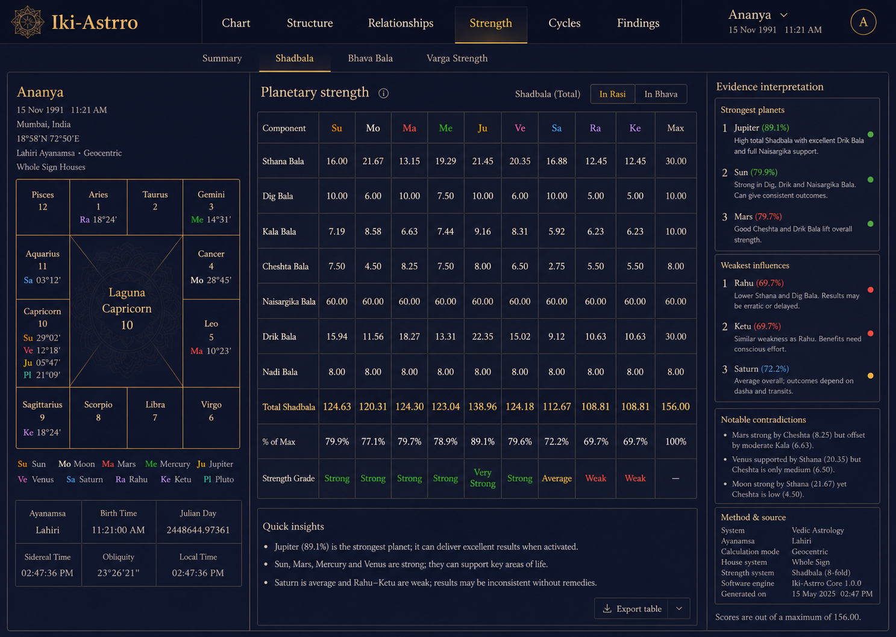

# Horoscope Explorer → Iki-Astrro UI moodboard

This moodboard preserves the Horoscope Explorer screen capture and the three Iki-Astrro
navigation directions generated from it. Horoscope Explorer is a **coverage reference** for
astrological data fields and report density, not a visual or navigation template.
> **Brand update (2026-09-08):** use the generated concepts for information architecture only. The palette, typography, main-screen composition and preserved assets are governed by [`brandguide_ikiastrro.md`](brandguide_ikiastrro.md).

## Source capture

- Installed reference: Horoscope Explorer Pro 3.81.
- Capture method: `D:\@ClaudeSpace\cproj_win_app_explorer` using its `pywinauto`/Win32 setup.
- Captured set: [35 analysis screens](reports/horoscope-explorer-screens/manifest.txt).
- Raw screen images: [`reports/horoscope-explorer-screens/`](reports/horoscope-explorer-screens/).
- Initial native control inventory: [`reports/horoscope-explorer-controls.txt`](reports/horoscope-explorer-controls.txt).

The reference app exposes 35 report screens through a selector plus a long icon strip. Iki-Astrro
should not reproduce either mechanism. Its navigation should reflect the astrologer's analysis
workflow and progressively reveal the underlying fields.

## Generated directions

### Direction 1 — Product sections

Primary tabs: **Overview · Charts · Evidence · Strengths · Timing · Interpretation**.

This is the clearest conventional product architecture. It separates raw chart inspection from
derived evidence and narrative interpretation, while supporting contextual second-level tabs.

### Direction 2 — Task-led diagnosis

Primary tabs: **Read Chart · Compare · Diagnose · Time Events · Explain**.

This most strongly expresses Iki-Astrro's product intent: reducing analytical omissions. It is
less literal than the domain taxonomy and may need carefully chosen labels for expert users.

### Direction 3 — Domain workbench

Primary tabs: **Chart · Structure · Relationships · Strength · Cycles · Findings**.

This is the strongest expert-facing information architecture. It scales naturally as the engine
adds more calculations and keeps the user's mental model close to the horoscope itself.

## Field-coverage map

| Iki-Astrro area | Horoscope Explorer screens used as field references | Relevant field groups |
|---|---|---|
| Overview | Quick View; General Details | identity, birth/place data, ayanamsha, chart anchors, current periods |
| Chart | Lagna & Planet Positions; Shodash Kundlis 1–4 | rāśi, longitude, nakshatra, pada, direction, dignity, D1–D60 charts |
| Structure | Bhava Table & Chalit Chakra; Upagrahas; Ashtakavarga; Maitri; Sudarshan; Karakas/Avasthas/Navtara | houses, bhava boundaries, special points, bindus, relationships, karakas, avasthas |
| Relationships | Planetary Conjunctions; Planetary Conjunction Results | conjunction/aspect matrices, participating grahas, orbs, interpreted effects |
| Strength | Shad Bala; Bhinnashtakavarga; Ashtakavarga & Shodhan | component strength, totals, thresholds, house/planet comparisons, reductions |
| Cycles | Shani Saade Saati; Vimshottari; Pratyantara; Tribhagi; Yogini/ShatTrimsha | period hierarchy, date windows, transit conditions, current and upcoming activation |
| Advanced methods | KP Longitudes/Significations/Kundlis; Jaimini Lagnas/Kundlis/Sphutas | method-specific positions, significators, special lagnas, sphutas and derived charts |
| Findings | Yogas & Results; General Predictions; Nakshatra/planet/house results | ranked findings, confirmations, contradictions, source, method and narrative explanation |

## Navigation principles carried forward

1. Keep no more than five or six persistent primary tabs.
2. Use contextual secondary tabs within the active primary area; do not expose every calculation
   as a top-level destination.
3. Keep the selected person, birth context and reading profile persistent across all analysis tabs.
4. Separate **observed/calculated data** from **derived evidence** and **interpretation**.
5. Make source, method, uncertainty and calculation coverage inspectable beside each finding.
6. Let large chart/table screens use the full workspace width; avoid dashboard-card fragmentation.
7. Apply Iki-Astrro's warm canvas, midnight blue, sunset orange and Manrope rather than
   Horoscope Explorer's white report canvas and legacy toolbar.

## Current recommendation

Use **Direction 3's domain workbench** as the structural base, then borrow Direction 2's
diagnostic behavior inside **Findings**. A practical first pass is:

**Chart · Structure · Relationships · Strength · Cycles · Findings**

Each area owns a short contextual second row. For example, Strength can contain **Summary ·
Shadbala · Bhava Bala · Varga Strength**, while Cycles can contain **Dashas · Transits · Saturn
cycles · Life weeks**.

